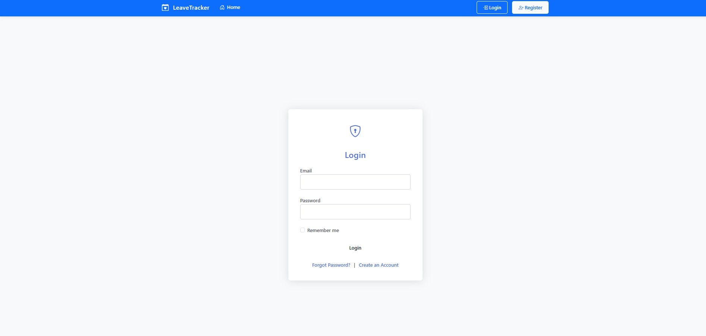
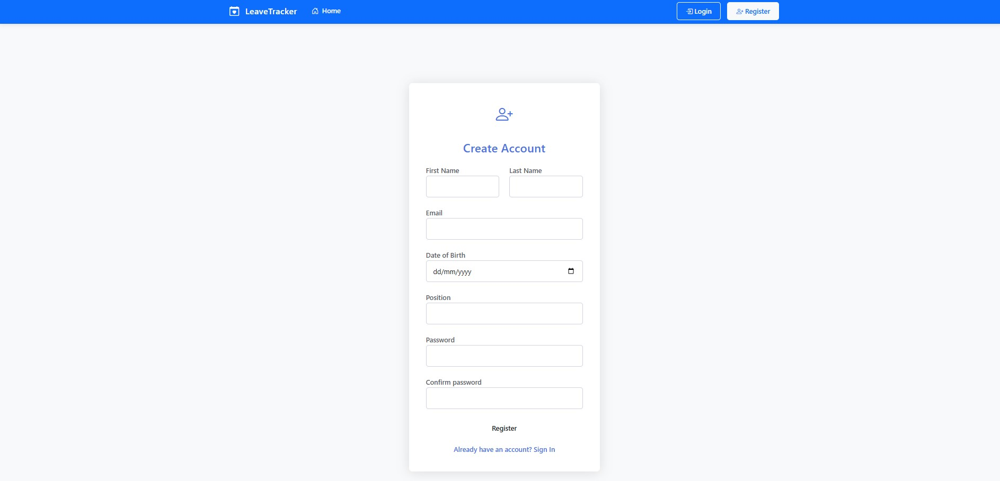
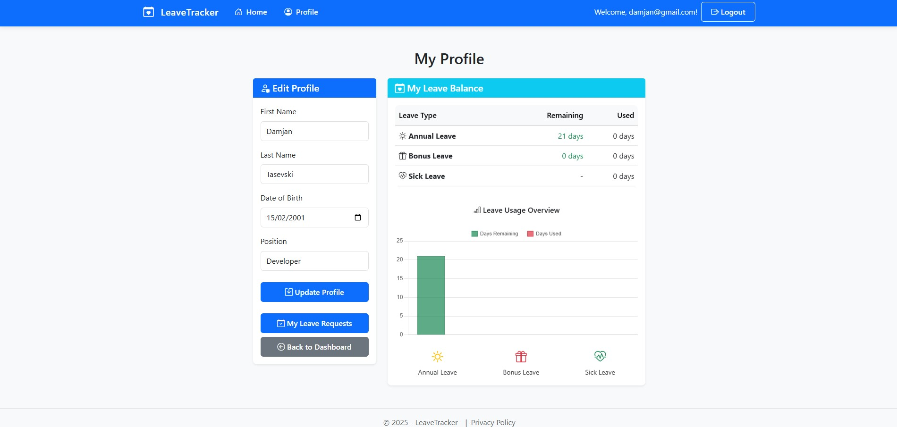
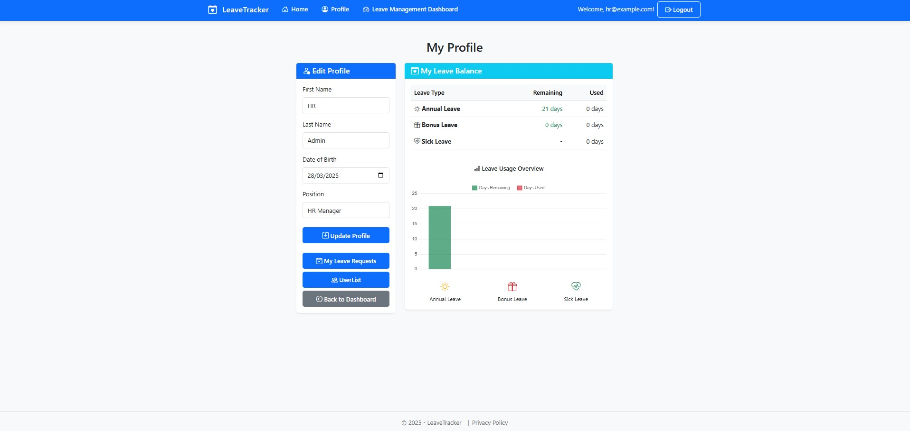
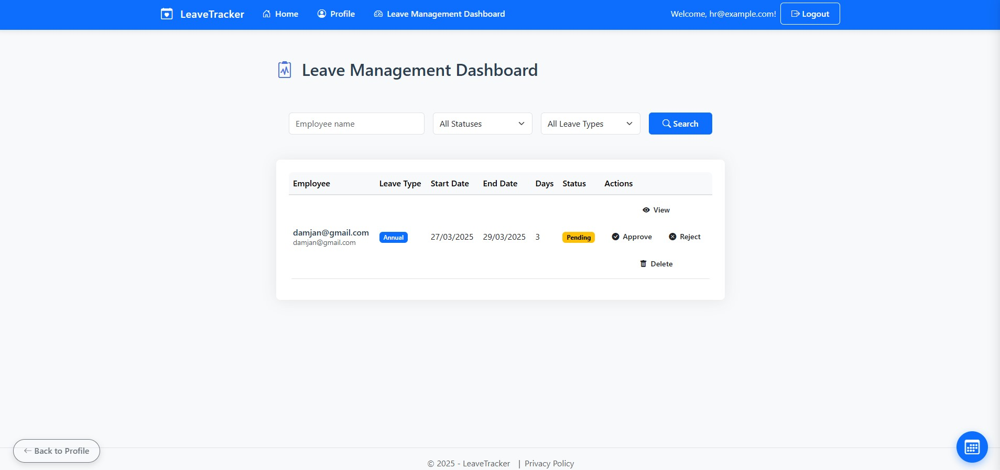
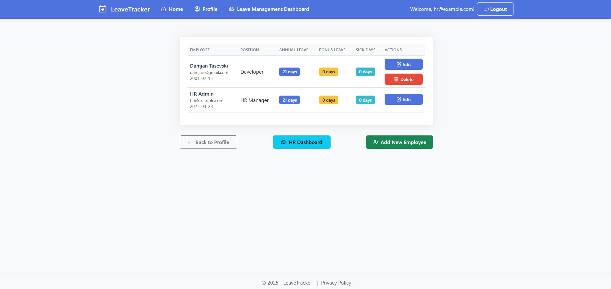
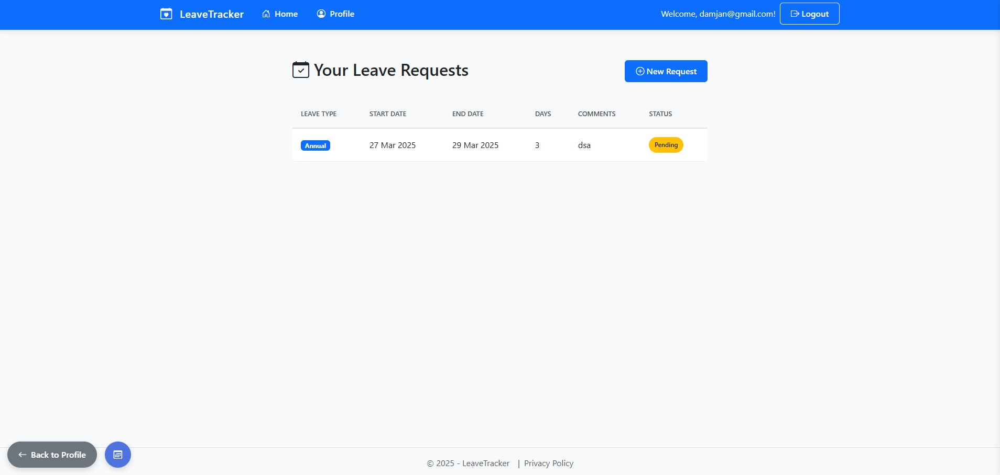
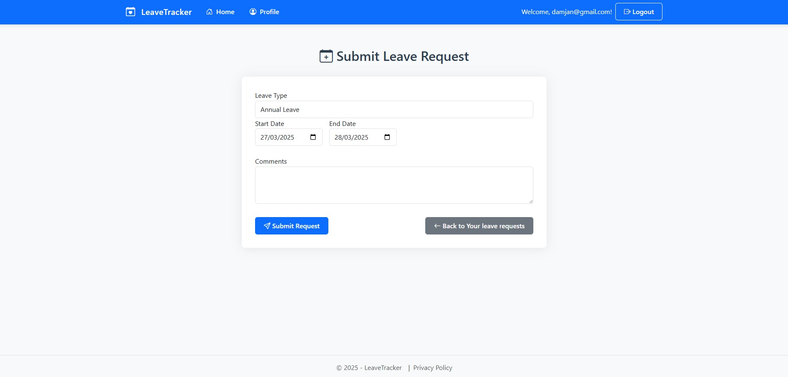

# Leave Management System 🏢📅

A modern **ASP.NET MVC** leave management system that handles employee leave requests, approvals, and HR oversight.

🛠️ Technologies Used
Category	Technologies
Backend	ASP.NET MVC, Entity Framework, C#
Frontend	Bootstrap 5, JavaScript, Razor Pages
Database	SQL Server
Auth	ASP.NET Identity with Role-Based Access Control
DevOps	GitHub Actions (CI/CD)
Testing	xUnit, Moq

## ✨ Key Features

### 🔐 Login/Register  

- **Allows employees** to register and log in securely  
- **Role-based access** (HR vs Regular Users)  
- **Password recovery** support  

---

### 👤 User Profiles  

- **For Regular Users**:  
  - View personal leave balance  
  - Update contact information  
- **For HR**:  
  - Manage all employee profiles  
  - Adjust leave allocations  

---

### 📊 HR Dashboard (Leave Management & User List)  

- **Real-time leave request monitoring**  
- **Bulk approval/rejection** of requests  
- **Employee search & filtering**  
- **Export user data** (CSV/Excel)  

---

### 📝 Leave Requests  

- **For All Users**:  
  - Submit new leave requests (with attachments)  
  - View request history & status  
  - Cancel pending requests  
- **Special Features**:  
  - 🏖️ Annual/Bonus/Sick leave tracking  
  - ⚕️ Medical report uploads  

---

🚀 Future Improvements

High Priority
💬 HR-Employee Chat System
Real-time messaging for leave request clarifications

📅 Enhanced Calendar Integration
Interactive calendar with drag-and-drop leave planning

📝 Rejection Comments
Mandatory comments when HR rejects leave requests

Medium Priority
🐳 Docker Support
Containerization for easier deployment

📱 Mobile Responsiveness
Optimize for phones/tablets

📊 Analytics Dashboard
Leave trend visualization (charts/graphs)

Innovation Ideas
🤖 Slack/MS Teams Integration
Notify HR via workplace chat apps

📅 Outlook/Google Calendar Sync
Auto-add approved leaves to personal calendars

🔍 Advanced Search
Filter leave requests by team/department
